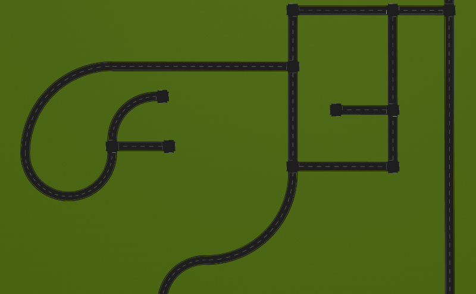

# Project Ideas for ECE 5532
Here are some ideas and starting points for ECE 5532 projects.

## Audibot Adaptive Cruise Control (ACC)

This project uses two instances of the Audibot simulator that was used throughout the course, and the goal is to implement adaptive cruise control where one car follows the other and regulates its following distance. For more details, see the [project-specific README](audibot_acc/README.md)

## Audibot Urban Navigation

This project uses the same Audibot simulator that was used throughout the course, but it is spawned in `road_world` with a camera to detect lane markings. The goal is to navigate around this world making turns at intersections to reach a goal. For more details, see the [project-specific README](audibot_urban_nav/README.md)

## IGVC Simulation

The Intelligent Ground Vehicle Competition (IGVC) is hosted every year at Oakland University. IGVC is a collegiate robotics competition where participants build and program an unmanned ground vehicle to navigate an outdoor course consisting of painted lines and obstacles.

This project involves simulating the obstacle course and implementing a ROS-based software system to get through it. For more details, see the [project-specific README](igvc_sim/README.md)

    
    

## Self-Balancing Robot Control

This project involves implementing a control system for a self-balancing robot in Gazebo by processing simulated IMU data and controlling the torque to the wheels of the robot.

A state space model of the vehicle dynamics is provided along with a state feedback control architecture, so the bulk of the project would involve implementing this control strategy and potentially investigating extensions to it. For more details, see the [project-specific README](self_balancing_control/README.md)

    

