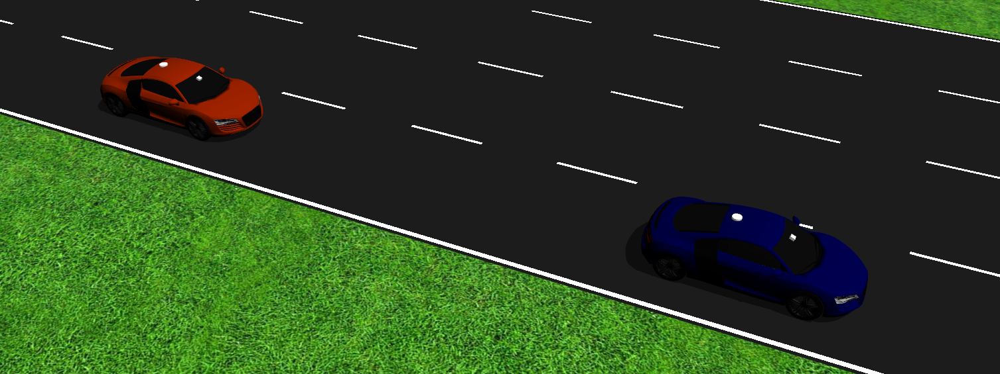
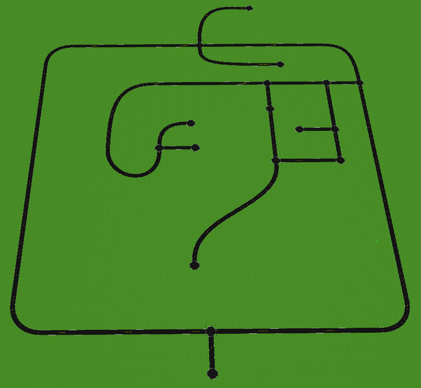
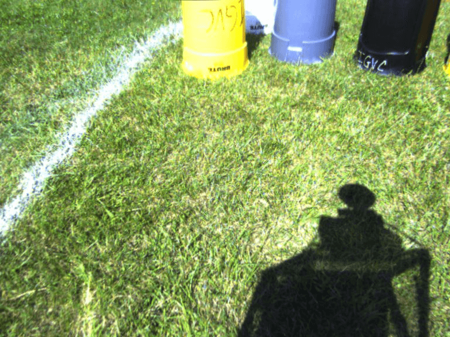
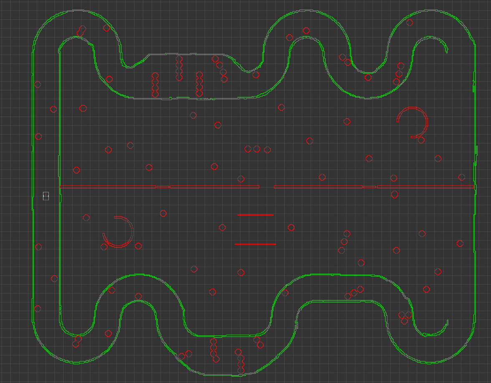
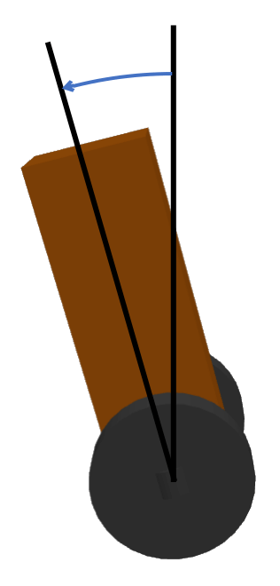

# Project Ideas for ECE 5532
Here are some ideas and starting points for ECE 5532 projects.

## Audibot Adaptive Cruise Control (ACC)

This project uses two instances of the Audibot simulator that was used throughout the course, and the goal is to implement adaptive cruise control where one car follows the other and regulates its following distance. For more details, see the [project-specific README](audibot_acc/README.md)

## Audibot Urban Navigation

This project uses the same Audibot simulator that was used throughout the course, but it is spawned in `urban_world` with a camera to detect lane markings. The goal is to navigate around this world making turns at intersections to reach a destination. For more details, see the [project-specific README](audibot_urban_nav/README.md)

## IGVC Robot Sensor Processing

The Intelligent Ground Vehicle Competition (IGVC) is hosted every year at Oakland University. IGVC is a collegiate robotics competition where participants build and program an unmanned ground vehicle to navigate an outdoor course consisting of painted lines and obstacles.
Here is a video of a robot running the course at the 2013 competition:
[YouTube Link](https://www.youtube.com/embed/Mt4OGEdjHuw?rel=0&autoplay=1)

This project involves processing data from a ROS bag recorded during one of the official runs by Oakland University's team in the 2014 competition and implementing the perception and mapping systems. For more details, see the [project-specific README](igvc_bag_processing/README.md)

## IGVC Simulation

This project involves simulating the IGVC obstacle course and implementing a ROS-based software system to process simulated sensor data and implement the entire software system required to navigate through it. For more details, see the [project-specific README](igvc_sim/README.md)

    
    

## Self-Balancing Robot Control

This project involves implementing a control system for a self-balancing robot in Gazebo by processing simulated IMU data and issuing commands to the wheels of the robot. For more details, see the [project-specific README](self_balancing_control/README.md)

    

