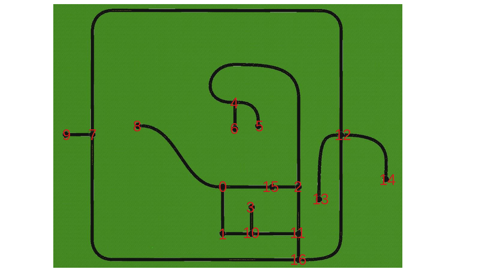

# Audibot Urban Navigation

This project uses the same Audibot simulator that was used throughout the course, but it is spawned in `urban_world` with a camera to detect lane markings. The goal is to navigate around this world making turns at intersections to reach a destination.

## Objectives

### Level 1: Develop control and logic to navigate intersections

- Use the `audibot_path_following` node to follow the lane markings between intersections.
- Implement logic to switch from path following mode to turn left or right at an intersection when necessary.
- Construct and execute a pre-determined sequence of turns to reach a particular intersection from the starting position.

### Level 2: Generalize the intersection navigation sequence

- Construct a graph with a node for each intersection and edges between the nodes representing the roads connecting the intersections.
- Develop an algorithm that searches the graph for a route between arbitrary start and end intersections. From this route, generate a sequence of left, right, and straight intersection actions to get from the start to the end.
- Execute the route using the same logic and controls developed in Level 1.

### Level 3: Detect the Color of the Traffic Lights
Some of the intersections in `urban_world` have traffic lights. Try to use the simulated camera image to detect the color and stop at the intersection if the light is red.

## Getting Started

In order to properly load the `urban_world` simulation, the `gazebo_traffic_light` repository should be cloned into your ROS workspace and compiled like normal:

```
cd ros/src
git clone https://github.com/robustify/gazebo_traffic_light.git
```

After it builds successfully, the simulation can be started with:
```
roslaunch audibot_urban_nav run_simulation.launch
```

## Coordinates of the Intersections
The geodetic coordinates of the center of the intersections is provided in `intersection_coordinates.csv`. The number corresponding to each intersection are labeled in `intersection_map.png` so you can see how they are connected to each other.

<p align="center">
    
</p>

## Making Turns at Intersections

Remap the output topic from the path following node (`/audibot/cmd_vel`) to the input topic of your node that implements the control and decision logic. Then remap the output topic from your node to `/audibot/cmd_vel` so it can control the vehicle instead.

While driving along the roads between intersections, just pass through the control signal coming from the path following node. When the vehicle gets close to the next intersection, replace the speed and/or yaw rate signals to make the required maneuver.
