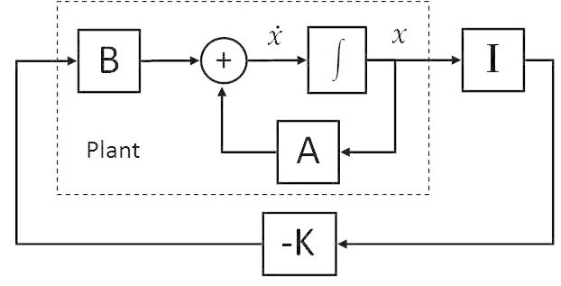

# Self-Balancing Robot Control

## Objectives

The goals for this project can be split into three levels, each building on the previous levels.

### Level 1: Implment State Feedback Stabilizer

- Clone the teeterbot self-balancing robot simulator from Github: [https://github.com/robustify/teeterbot](https://github.com/robustify/teeterbot)
- Read `teeterbot`'s documentation to learn how to configure and start the simulation.
- Study the state feedback controller design outlined below and implement the controller in a ROS node.
- Set up launch file(s) to run the simulation and the controller.
- Test the robustness of the controller by applying external force to the self-balancing robot using the `/teeterbot/nudge` service.

### Level 2: Extend State Feedback Stabilizer

Instead of just balancing the robot and coming to a stop, extend the stabilizer into a regulator that tracks a speed reference input.

### Level 3: Implement a Complete Drive Control System

Extend the speed regulator from Level 2 to input a complete `geometry_msgs/Twist` message that includes speed and yaw rate commands.
Apply differential drive kinematics from to control the relative difference in wheel speeds to track the yaw rate command.

## Diagram of the System

A diagram of the self-balancing robot to be controlled is shown here:

    

The parameters $m_1$ and $m_2$ represent the mass of the base and the body, respectively.
The length of the arm is denoted by $l$, the position of the vehicle is denoted by $x$, and the tilt angle of the body from vertical is denoted by $\theta$.
Finally, the force input to the system is denoted by $u$.

## Lagrangian Mechanics

Due to the complexity of the system, formulating an accurate model by applying Newton's second law is very difficult.
Therefore, principles of Lagrangian mechanics are used instead.

First, the Lagrangian is found by subtracting the total potential energy of the system from the total kinetic energy of the system.
The kinetic energy of the system is the sum of the translational kinetic energy of the base, translational kinematic energy of the body, and the rotational kinetic energy of the body:

$$K = \frac{1}{2}m_1\dot{x}^2 + \frac{1}{2}m_2\left(\dot{x_c}^2+\dot{z_c}^2\right) + \frac{1}{2}J\dot{\theta}^2$$

where $\dot{x_c} = \dot{x}+\frac{1}{2}l\dot{\theta}\cos{\theta}$ and $z_c = -\frac{1}{2}l\dot{\theta}\sin{\theta}$ are the $x$ and $z$ velocities of the body's center of mass, and $J=\frac{1}{3}m_2l^2$ is the moment of inertia of the body rotating about its end.
The potential energy in the system is computed from the height of the center of mass of the body:

$$U = \frac{1}{2}m_2gl\cos{\theta}$$

The Lagrangian defined is then found by subtracting potential energy from kinetic energy:

$$\mathcal{L} = \left(\frac{1}{2}m_1\dot{x}^2 + \frac{1}{2}m_2\left[\left(\dot{x}+\frac{1}{2}l\dot{\theta}\cos{\theta}\right)^2+\left(-\frac{1}{2}l\dot{\theta}\sin{\theta}\right)^2\right] + \frac{1}{2}J\dot{\theta}^2\right) - \left(\frac{1}{2}m_2gl\cos{\theta}\right)$$

and after some simplification:

$$\Rightarrow\mathcal{L}= \frac{1}{2}\left(m_1+m_2\right)\dot{x}^2+\frac{1}{2}m_2l\dot{x}\dot{\theta}\cos{\theta}+\frac{1}{8}\left(m_2l^2+4J\right)\dot{\theta}^2-\frac{1}{2}m_2gl\cos{\theta}$$

The equations of motion can then be found from the $x$ and $\theta$ Lagrangian equations:

$$\left(
\begin{array}{l}
    F_x = \frac{\delta}{\delta{t}}\left(\frac{\delta\mathcal{L}}{\delta{\dot{x}}}\right) - \frac{\delta\mathcal{L}}{\delta{x}} \\ \ \\
    F_\theta = \frac{\delta}{\delta{t}}\left(\frac{\delta\mathcal{L}}{\delta{\dot\theta}}\right) - \frac{\delta\mathcal{L}}{\delta\theta}
\end{array}
\right.
$$

where $F_x$ and $F_\theta$ are the applied force in the $x$ axis, and the torque applied around $\theta$, respectively.
Because the vehicle can only control the linear $x$ force, 0 is plugged in for $F_\theta$:

$$
\left(
\begin{array}{l}
    F_x = \left(m_1+m_2\right)\ddot{x} + \frac{1}{2}m_2l\ddot{\theta}\cos{\theta} - \frac{1}{2}m_2l\dot{\theta}^2\sin{\theta}\\ \ \\
    0=\frac{1}{2}m_2l\ddot{x}\cos{\theta}+\frac{1}{4}\left(m_2l^2+4J\right)\ddot{\theta} - \frac{1}{2}m_2lg\sin{\theta}
\end{array}
\right.
$$

After some rearranging, the equations of motion for the inverted pendulum system are obtained:

$$
\left(
\begin{array}{l}
    \ddot{x} = \frac{m_2l}{2\left(m_1+m_2\right)}\dot{\theta}^2\sin{\theta} - \frac{m_2l}{2\left(m_1+m_2\right)}\ddot{\theta}\cos{\theta} + \frac{1}{m_1+m_2}F_x\\ \ \\
    \ddot{\theta} = -\frac{2m_2l}{m_2l^2+4J}\ddot{x}\cos{\theta}+\frac{2m_2lg}{m_2l^2+4J}\sin{\theta}
\end{array}
\right.
$$

## State Space Model

After obtaining the equations of motion, a state space model can be developed for the system using appropriate state definitions.

The states are chosen as follows: $x_1=\dot{x},\quad x_2=\theta,\quad x_3=\dot{\theta}$.

Using these state definitions and substituting them into the equations of motion derived above, the nonlinear state equations are:

$$
\dot{x}=f\left(x,\ F_x\right) \Rightarrow
\left(
    \begin{array}{l}
        \dot{x}_1 = \dfrac{1}{1-\alpha\cos^2x_2}\left(-\alpha{g}\sin{x_2}\cos{x_2} + \gamma{x_3^2}\sin{x_2}+\phi F_x\right)\\~\\
        \dot{x}_2 = x_3 \\~\\
        \dot{x}_3 = \dfrac{1}{1-\alpha\cos^2x_2}\left(-\alpha x_3^2\sin{x_2} - \beta F_x\cos x_2 + \sigma\sin x_2\right) & ~
    \end{array}
\right.
$$

where the constant parameters are lumped together according to:

$$\alpha=\dfrac{m_2^2l^2}{(m_1+m_2)(m_2l^2+4J)},\quad \beta=\dfrac{2m_2l}{(m_1+m_2)(m_2l^2+4J)}$$

$$\gamma=\dfrac{m_2l}{2(m_1+m2)},\qquad \sigma=\dfrac{2m_2lg}{(m_2l^2+4J)},\qquad \phi=\dfrac{1}{m_1+m_2}$$

In order to develop a state space model, the state equations must be linearized about the equilibrium point of the system.
This equilibrium point is where the inverted pendulum is perfectly balanced $\left(\theta = 0,\ \dot{\theta} = 0\right)$, and the base is not moving $\left(\dot{x} = 0\right)$.
This corresponds to the state vector $x=\begin{bmatrix}0&0&0\end{bmatrix}^T$, with the input $F_x=0$.

Therefore, the $A$ matrix of the state space model is found by computing the Jacobian of the non-linear state equations with respect to the state vector and substituting in the equilibrium point state vector and input.
The $B$ matrix is the Jacobian of the state equations with respect to the input term, plugging in the equilibrium point.

$$
A = \left.
    \begin{bmatrix}
        \frac{\delta f_1}{\delta x_1} & \frac{\delta f_1}{\delta x_2} & \frac{\delta f_1}{\delta x_3}\\
        \frac{\delta f_2}{\delta x_1} & \frac{\delta f_2}{\delta x_2} & \frac{\delta f_2}{\delta x_3}\\
        \frac{\delta f_3}{\delta x_1} & \frac{\delta f_3}{\delta x_2} & \frac{\delta f_3}{\delta x_3}
    \end{bmatrix}
    \right|_{{F_x=0}\atop{x=0}}
    =\begin{bmatrix}
    0 & -\dfrac{\alpha g}{1-\alpha} & 0\\
    0 & 0 & 1\\
    0 & \dfrac{\sigma}{1-\alpha} & 0
    \end{bmatrix}
$$

$$
B = \left.
    \begin{bmatrix}
    \frac{\delta f_1}{\delta F_x} \\
    \frac{\delta f_2}{\delta F_x} \\
    \frac{\delta f_3}{\delta F_x} \\
    \end{bmatrix}
    \right|_{{F_x=0}\atop{x=0}}
    = \begin{bmatrix}
    \dfrac{\phi}{1-\alpha}\\ 0 \\ -\dfrac{\beta}{1-\alpha}
    \end{bmatrix}
$$

The eigenvalues of the $A$ matrix represent the poles of the inverted pendulum system.
The stability of the system can be predicted by simply checking the real parts of the eigenvalues to be negative.
After plugging in the parameters of the system: $m_1=2$ Kg, $m_2=10$ Kg, $l=0.8$ m, $J=\frac{1}{3}m_2l^2=2.14$ Kg-m $^2$, $g=9.81\ \textrm{m}/\textrm{s}^2$, the eigenvalues can be computed.

$$
\left|\lambda I-A\right| = 0 \rightarrow\begin{vmatrix}
\lambda & \quad 5.45 & \quad 0 \\
0 & \quad\lambda & \quad -1 \\
0 & \quad -16.35 & \quad\lambda
\end{vmatrix} = 0
$$
$$\Rightarrow \lambda=0,\ 4.04,\ -4.04$$

As expected, the system is unstable, as indicated by the two eigenvalues either on the imaginary axis or in the right half plane.
However, the state space model can be used to stabilize the inverted pendulum if it is controllable.
Testing for controllability can be done easily with numerical $A$ and $B$ matrices in MATLAB using the `ctrb` function in the Control Systems Toolbox to test if the controllability matrix has full rank.

As it turns out, the controllability matrix indeed has full rank, indicating that the linearized system is controllable.

$$\text{rank}\left(\begin{bmatrix}B & AB & A^2B\end{bmatrix}\right)=3 \rightarrow\text{Full Rank}$$

## Linear State Feedback Stabilizer Design

Assuming that all three states of the state space model are measureable, a state feedback gain matrix $K$ can be defined such that the input command $F_x=-Kx$.
With an appropriate $K$ matrix, the system will be driven toward the equilibrium point by actively controlling the force input $F_x$.

$$\dot{x} = Ax+Bu = Ax+B\left(-Kx\right)$$

$$\Rightarrow\dot{x} = \left(A-BK\right)x$$

A block diagram of the static linear state feedback controller is shown here:

    

The $K$ matrix is selected in such a way as to place the poles of the system at stable values. This is done by setting the eigenvalues of the $A-BK$ matrix, and then solving for the elements of $K$.
MATLAB's `place` command is available to do exactly this!

**To compute the output force $F_x$ in your ROS node, you need the three elements of the $K$ matrix designed with `place`, and measurements of $\dot{x}$, $\theta$, and $\dot{\theta}$.**

$$F_x = -Kx\ \Rightarrow\ F_x = -k_1\dot{x} - k_2\theta - k_3\dot{\theta}$$

$\dot{x}$ is the vehicle speed, $\theta$ is the pitch angle of the body, and $\dot{\theta}$ is the angular rate of the body's pitch angle.
The vehicle speed measurement comes from wheel speed measurements and wheel radius.
Pitch angle comes from the quaternion orientation in the simulated IMU message:

$TODO$

and pitch rate comes directly from the `angular_velocity` field of the IMU message.